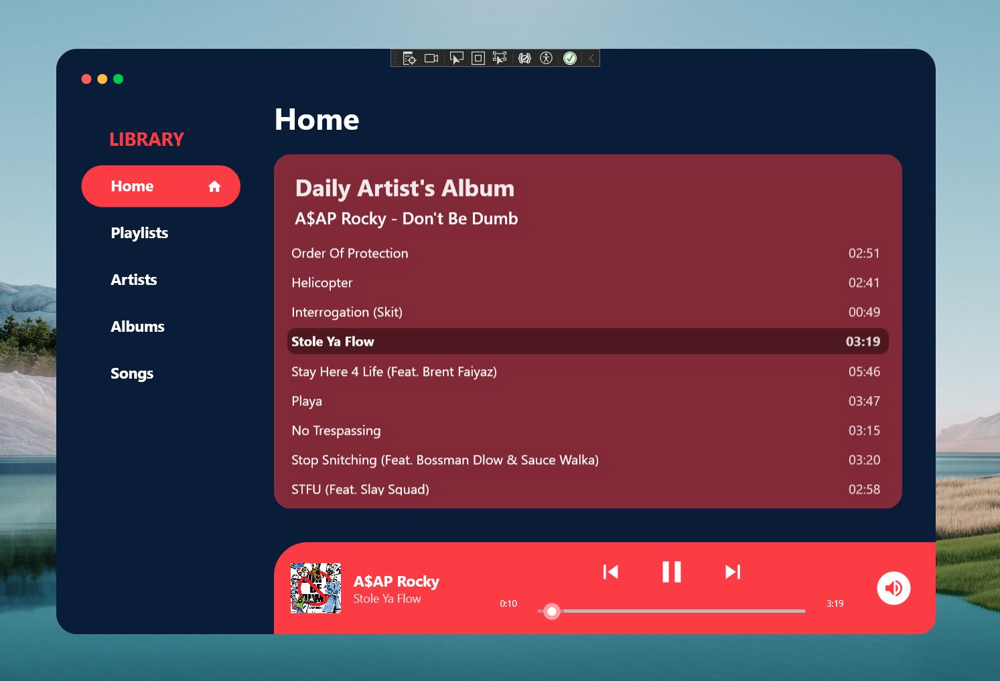
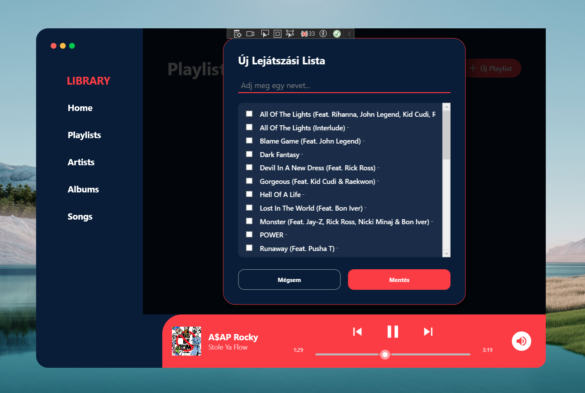
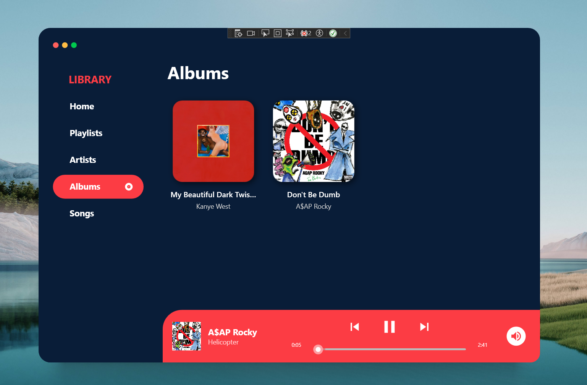
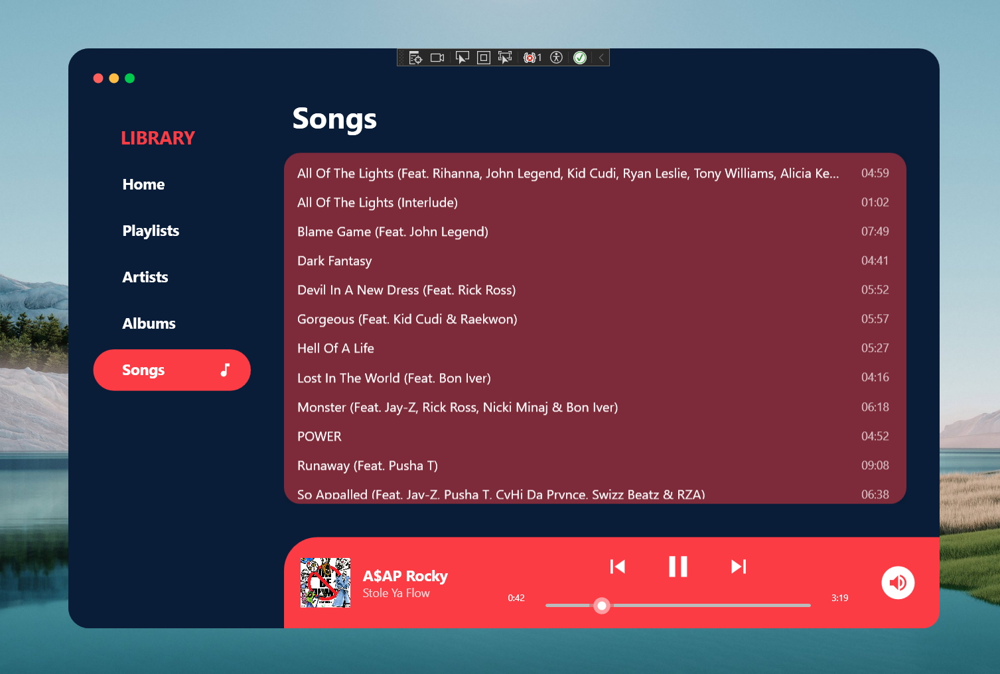

# MusicPlayer MVVM

> A WPF-based desktop audio player built with .NET 8 focusing on Clean Code principles and strict MVVM architectural separation.

---

## Screenshots

  <table>
    <tr>
      <td align="center">
        
         <b>Home / Daily Artist-s Album View</b>
      </td>
      <td align="center">
        
         <b>Playlist make view</b>
      </td>
    </tr>
    <tr>
      <td align="center">
        
         <b>Albums view</b>
      </td>
      <td align="center">
        
         <b>Songs view</b>
      </td>
    </tr>
  </table>

---

## Features

* 🎶 **Library Browsing:** Artist, Album, and Song-based library browsing with UI virtualization for high-performance listing.
* 📋 **Playlist Management:** Local playlist management system with track selection overlay and persistent data binding.
* 🎧 **Integrated Audio Engine:** Supports real-time playback tracking, seeking, and volume control.
* 🧩 **Service-Oriented Architecture:** Uses dependency inversion for audio playback and OS dialogs.

---

## Architecture and Clean Code

This project was built with a strong emphasis on maintainability, scalability, and clean architecture:

* **Strict MVVM Pattern:** ViewModels are split into partial classes (`Playback`, `Navigation`, `Playlists`) using source generators to maintain the Single Responsibility Principle.
* **Dependency Inversion (IoC):** High-level modules depend on abstractions (`IAudioPlayerService`, `IOpenFileDialogService`) rather than concrete UI implementations, making the core logic highly testable.
* **Resource Management:** Optimized XAML grid structures ensure consistent layout behavior and efficient memory usage without visual stuttering.

---

## Dependencies / Tech Stack

* **[C# / .NET 8.0](https://dotnet.microsoft.com/)** - Core framework.
* **[CommunityToolkit.Mvvm](https://learn.microsoft.com/en-us/dotnet/communitytoolkit/mvvm/)** - Used for source-generated observable properties and commands, keeping boilerplate code to a minimum.
* **[NAudio](https://github.com/naudio/NAudio)** - Primary audio engine for robust playback and stream management.
* **[MahApps.Metro.IconPacks.Material](https://github.com/MahApps/MahApps.Metro.IconPacks)** - Vector-based UI iconography for crisp, scalable visuals.